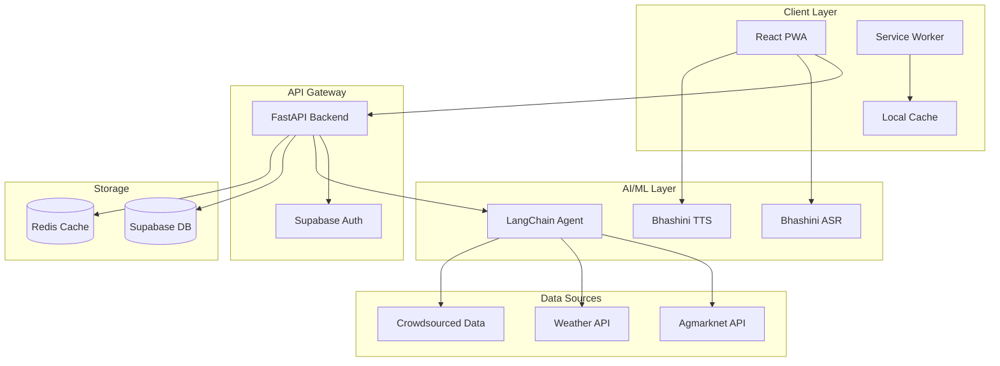

# Design Document: Market Mania

## Overview

Market Mania is a multilingual marketplace application designed specifically for semi-literate vendors in Indian markets. The system provides AI-powered pricing insights through a Price Power Index (PPI), fair price certification via QR codes, and voice-first interactions across multiple Indian languages. The application follows an offline-first PWA architecture to ensure reliability in areas with poor connectivity.

The core value proposition centers on empowering vendors with data-driven pricing decisions while building consumer trust through transparent price verification. The system integrates multiple data sources (wholesale prices, weather data, crowdsourced local prices) through LangChain agents to provide intelligent pricing recommendations.

## Architecture

### High-Level Architecture



### Technology Stack

**Frontend:**
- React 18 with TypeScript for type safety and modern development
- PWA with Workbox for offline-first functionality
- React-i18next for internationalization supporting Hindi, English, and regional languages
- Tailwind CSS for responsive, mobile-first design
- React Query for efficient data fetching and caching

**Backend:**
- FastAPI with Python for high-performance API development
- LangChain for AI agent orchestration and tool integration
- Supabase for authentication, database, and real-time features
- Redis for caching and session management
- Celery for background task processing

**AI/ML Services:**
- Bhashini (AI4Bharat) for multilingual ASR and TTS
- LangChain agents for PPI calculation and market analysis
- Custom ML models for price anomaly detection

### ML Model Architecture

#### Price Anomaly Detection Model
```python
# Model: XGBoost Classifier for anomaly detection
FEATURES = [
    'price_deviation_from_mean',     # How far from historical average
    'price_change_velocity',         # Rate of price change
    'vendor_submission_frequency',   # How often vendor submits
    'market_volatility_index',       # Current market stability
    'seasonal_adjustment_factor',    # Expected seasonal variation
    'weather_impact_score',          # Weather-related price pressure
    'wholesale_price_correlation',   # Correlation with wholesale data
    'peer_vendor_price_similarity'   # How similar to nearby vendors
]

MODEL_CONFIG = {
    'n_estimators': 100,
    'max_depth': 6,
    'learning_rate': 0.1,
    'threshold': 0.7  # Anomaly score threshold
}
```

#### PPI Scoring Integration
The ML model outputs anomaly scores (0-1) that integrate into PPI calculations:
- **Normal submissions (score < 0.3)**: Full weight in PPI calculation
- **Suspicious submissions (0.3-0.7)**: Reduced weight (50%)
- **Anomalous submissions (> 0.7)**: Excluded from PPI, flagged for review

**External Integrations:**
- Agmarknet API for wholesale price data
- Weather API for spoilage risk assessment
- WhatsApp Business API for notifications

## Components and Interfaces

### Core Components

#### 1. Authentication Service
```typescript
interface AuthService {
  login(phoneOrEmail: string): Promise<OTPResponse>
  verifyOTP(token: string, otp: string): Promise<AuthResult>
  refreshToken(refreshToken: string): Promise<TokenPair>
  logout(): Promise<void>
}

interface VendorProfile {
  id: string
  name: string
  stallId: string
  marketLocation: string
  preferredLanguage: LanguageCode
  phoneNumber: string
  email?: string
  createdAt: Date
  lastActive: Date
}
```

#### 2. PPI Calculation Engine
```typescript
interface PPIEngine {
  calculatePPI(request: PPIRequest): Promise<PPIResult>
  explainPPI(ppiId: string): Promise<PPIExplanation>
  getBulkPPI(products: ProductQuery[]): Promise<PPIResult[]>
}

interface PPIRequest {
  productId: string
  quantity: number
  marketLocation: string
  vendorId: string
}

interface PPIResult {
  ppi: number // 0-100 scale
  confidence: number // 0-100 scale
  recommendation: PPIRecommendation
  factors: PPIFactor[]
  expiresAt: Date
}

interface PPIFactor {
  type: 'wholesale' | 'weather' | 'crowdsourced' | 'historical'
  weight: number
  value: number
  impact: 'positive' | 'negative' | 'neutral'
  description: string
}
```

#### 3. Fair Price Certificate System
```typescript
interface FPCService {
  generateCertificate(request: FPCRequest): Promise<FPCResult>
  verifyCertificate(qrCode: string): Promise<FPCVerification>
  getCertificateHistory(vendorId: string): Promise<FPCHistory[]>
  shareCertificate(fpcId: string, method: 'whatsapp' | 'sms'): Promise<void>
}

interface FPCRequest {
  vendorId: string
  productId: string
  price: number
  quantity: number
  ppiReference?: string
}

interface FPCResult {
  id: string
  qrCode: string // Base64 encoded QR image
  qrData: string // Encrypted and signed QR data
  signature: string // HMAC signature for authenticity
  expiresAt: Date
  shareUrl: string
}

// QR Code Security
interface QRCodeSecurity {
  encryptData(data: FPCData, key: string): string
  signData(encryptedData: string, secret: string): string
  verifySignature(data: string, signature: string, secret: string): boolean
  decryptData(encryptedData: string, key: string): FPCData
}
```

#### 4. Voice Interface System
```typescript
interface VoiceService {
  startListening(language: LanguageCode): Promise<void>
  stopListening(): Promise<string> // Returns transcribed text
  speak(text: string, language: LanguageCode): Promise<void>
  processVoiceQuery(audio: Blob, language: LanguageCode): Promise<VoiceResponse>
}

interface VoiceResponse {
  transcription: string
  intent: VoiceIntent
  response: string
  audioResponse?: Blob
}

interface VoiceIntent {
  type: 'ppi_query' | 'fpc_generate' | 'price_submit' | 'navigation' | 'help'
  entities: Record<string, any>
  confidence: number
}
```

#### 5. Crowdsourced Data Service
```typescript
interface CrowdDataService {
  submitPrice(submission: PriceSubmission): Promise<SubmissionResult>
  validateSubmission(submissionId: string): Promise<ValidationResult>
  getLocalPrices(location: string, productId: string): Promise<LocalPriceData[]>
  reportSuspiciousData(submissionId: string, reason: string): Promise<void>
}

interface PriceSubmission {
  vendorId: string
  productId: string
  price: number
  quantity: number
  marketLocation: string
  submissionMethod: 'voice' | 'manual'
  timestamp: Date
}
```

### API Interfaces

#### REST API Endpoints
```
POST /auth/login
POST /auth/verify-otp
POST /auth/refresh
POST /auth/logout

GET /vendor/profile
PUT /vendor/profile
GET /vendor/dashboard

POST /ppi/calculate
GET /ppi/explain/{ppiId}
POST /ppi/bulk

POST /fpc/generate
GET /fpc/verify/{qrCode}
GET /fpc/history
POST /fpc/share

POST /voice/process
POST /voice/tts

POST /crowd/submit-price
GET /crowd/local-prices
POST /crowd/report

GET /admin/analytics
GET /admin/vendors
POST /admin/moderate
```

#### WebSocket Events
```typescript
interface WebSocketEvents {
  'ppi_update': PPIUpdateEvent
  'market_alert': MarketAlertEvent
  'fpc_scanned': FPCScannedEvent
  'voice_processing': VoiceProcessingEvent
}
```

## Data Models

### Database Schema

#### Vendors Table
```sql
CREATE TABLE vendors (
  id UUID PRIMARY KEY DEFAULT gen_random_uuid(),
  name VARCHAR(255) NOT NULL,
  stall_id VARCHAR(100),
  market_location VARCHAR(255) NOT NULL,
  phone_number VARCHAR(20) UNIQUE NOT NULL,
  email VARCHAR(255),
  preferred_language VARCHAR(10) DEFAULT 'hi',
  points INTEGER DEFAULT 0,
  status VARCHAR(20) DEFAULT 'active',
  created_at TIMESTAMP DEFAULT NOW(),
  updated_at TIMESTAMP DEFAULT NOW()
);
```

#### Products Table
```sql
CREATE TABLE products (
  id UUID PRIMARY KEY DEFAULT gen_random_uuid(),
  name_en VARCHAR(255) NOT NULL,
  name_hi VARCHAR(255),
  name_regional JSONB, -- {language_code: name}
  category VARCHAR(100) NOT NULL,
  unit VARCHAR(20) NOT NULL, -- kg, quintal, piece
  perishable BOOLEAN DEFAULT false,
  seasonal_pattern JSONB,
  created_at TIMESTAMP DEFAULT NOW()
);
```

#### PPI Calculations Table
```sql
CREATE TABLE ppi_calculations (
  id UUID PRIMARY KEY DEFAULT gen_random_uuid(),
  vendor_id UUID REFERENCES vendors(id),
  product_id UUID REFERENCES products(id),
  ppi_value INTEGER NOT NULL CHECK (ppi_value >= 0 AND ppi_value <= 100),
  confidence INTEGER NOT NULL CHECK (confidence >= 0 AND confidence <= 100),
  factors JSONB NOT NULL,
  wholesale_price DECIMAL(10,2),
  weather_risk DECIMAL(3,2),
  crowd_price DECIMAL(10,2),
  recommendation VARCHAR(50) NOT NULL,
  expires_at TIMESTAMP NOT NULL,
  created_at TIMESTAMP DEFAULT NOW()
);
```

#### Fair Price Certificates Table
```sql
CREATE TABLE fair_price_certificates (
  id UUID PRIMARY KEY DEFAULT gen_random_uuid(),
  vendor_id UUID REFERENCES vendors(id),
  product_id UUID REFERENCES products(id),
  price DECIMAL(10,2) NOT NULL,
  quantity DECIMAL(10,2) NOT NULL,
  qr_code TEXT NOT NULL,
  qr_data TEXT NOT NULL,
  ppi_reference UUID REFERENCES ppi_calculations(id),
  scan_count INTEGER DEFAULT 0,
  status VARCHAR(20) DEFAULT 'active',
  expires_at TIMESTAMP NOT NULL,
  created_at TIMESTAMP DEFAULT NOW()
);
```

#### Price Submissions Table
```sql
CREATE TABLE price_submissions (
  id UUID PRIMARY KEY DEFAULT gen_random_uuid(),
  vendor_id UUID REFERENCES vendors(id),
  product_id UUID REFERENCES products(id),
  price DECIMAL(10,2) NOT NULL,
  quantity DECIMAL(10,2) NOT NULL,
  market_location VARCHAR(255) NOT NULL,
  submission_method VARCHAR(20) NOT NULL,
  validation_status VARCHAR(20) DEFAULT 'pending',
  points_awarded INTEGER DEFAULT 0,
  flagged BOOLEAN DEFAULT false,
  created_at TIMESTAMP DEFAULT NOW()
);
```

### Caching Strategy

#### Redis Cache Structure
```
ppi:{vendor_id}:{product_id} -> PPIResult (TTL: 5 minutes)
market_data:{location}:{date} -> MarketData (TTL: 1 hour)
vendor_session:{session_id} -> VendorSession (TTL: 24 hours)
voice_processing:{request_id} -> VoiceProcessingState (TTL: 30 seconds)
fpc_verification:{qr_code} -> FPCVerification (TTL: 1 hour)
```

#### PWA Cache Strategy
```typescript
// Service Worker Caching Rules
const CACHE_STRATEGIES = {
  static_assets: 'CacheFirst', // CSS, JS, images
  api_data: 'NetworkFirst', // PPI, prices
  offline_fallback: 'CacheOnly', // Offline pages
  user_data: 'NetworkFirst' // Profile, history
}

const CACHE_EXPIRY = {
  static: '30 days',
  api: '5 minutes',
  offline: 'never',
  user: '1 hour'
}
```

## Correctness Properties

*A property is a characteristic or behavior that should hold true across all valid executions of a system—essentially, a formal statement about what the system should do. Properties serve as the bridge between human-readable specifications and machine-verifiable correctness guarantees.*

Before defining the correctness properties, I need to analyze the acceptance criteria from the requirements to determine which ones are testable as properties.

<function_calls>
<invoke name="prework">
<parameter name="featureName">market-mania

Based on the prework analysis, I'll now define the key correctness properties that emerge from the requirements:

### Property 1: Authentication Round Trip
*For any* valid phone number or email, when an OTP is requested, sent, and verified within the time limit, the system should successfully authenticate the vendor and create a valid session.
**Validates: Requirements 1.1, 1.2**

### Property 2: Profile Data Persistence
*For any* vendor profile creation with required fields (name, stall ID, market location), the system should store all provided data and make it retrievable in subsequent sessions.
**Validates: Requirements 1.5**

### Property 3: Language Preference Consistency
*For any* selected language preference, the system should persist this choice across sessions and ensure all UI elements and voice interactions use the selected language consistently.
**Validates: Requirements 2.3, 2.4, 2.5**

### Property 4: PPI Calculation Completeness
*For any* product price query, the PPI calculation should incorporate all available data sources (wholesale, weather, crowdsourced, historical) and return a value between 0-100 with appropriate confidence scoring.
**Validates: Requirements 3.1, 3.2**

### Property 5: PPI Color Coding Accuracy
*For any* PPI value, the system should display the correct color coding (red for <30, yellow for 30-70, green for >70) with corresponding advice.
**Validates: Requirements 3.3, 3.4, 3.5**

### Property 6: FPC Generation Uniqueness
*For any* price-product combination, the system should generate a unique QR code containing all required data (price, product details, vendor ID, timestamp) that can be successfully verified.
**Validates: Requirements 4.1, 4.2**

### Property 7: FPC Expiration Handling
*For any* Fair Price Certificate, when 24 hours have elapsed since creation, the system should mark it as expired and require regeneration for new transactions.
**Validates: Requirements 4.5**

### Property 8: Voice Interface Accuracy
*For any* voice input in supported languages, the ASR should achieve at least 85% accuracy and the TTS should respond in the same language within 3 seconds.
**Validates: Requirements 5.1, 5.3**

### Property 9: Price Submission Validation
*For any* price data submission, the system should validate it against existing data for outliers, award points for valid submissions, and flag suspicious data appropriately.
**Validates: Requirements 6.1, 6.3, 6.5**

### Property 10: QR Code Verification Consistency
*For any* QR code scan, the system should validate authenticity and display appropriate verification status (green for valid, red for invalid/expired) with correct messaging.
**Validates: Requirements 7.1, 7.3, 7.4**

### Property 11: Offline Data Synchronization
*For any* offline actions performed, when connectivity is restored, the system should sync all queued operations and update cached data without data loss.
**Validates: Requirements 8.3**

### Property 12: Cache Eviction Strategy
*For any* storage quota exceeded scenario, the system should remove oldest cached data first while preserving critical functionality data.
**Validates: Requirements 8.5**

## Error Handling

### Error Categories and Strategies

#### 1. Network and Connectivity Errors
```typescript
interface NetworkErrorHandler {
  handleOfflineMode(): void
  retryWithBackoff(operation: () => Promise<any>, maxRetries: number): Promise<any>
  queueOfflineActions(action: OfflineAction): void
  syncWhenOnline(): Promise<void>
}

// Exponential backoff for API retries
const RETRY_CONFIG = {
  maxRetries: 3,
  baseDelay: 1000, // 1 second
  maxDelay: 10000, // 10 seconds
  backoffFactor: 2
}
```

#### 2. Voice Processing Errors
```typescript
interface VoiceErrorHandler {
  handleASRFailure(error: ASRError): VoiceErrorResponse
  handleTTSFailure(error: TTSError): VoiceErrorResponse
  handleNoiseInterference(): VoiceErrorResponse
  handleUnsupportedLanguage(language: string): VoiceErrorResponse
}

interface VoiceErrorResponse {
  fallbackMethod: 'text_input' | 'retry' | 'help'
  userMessage: string
  retryAllowed: boolean
}
```

#### 3. Data Validation Errors
```typescript
interface ValidationErrorHandler {
  validatePriceSubmission(submission: PriceSubmission): ValidationResult
  handleOutlierDetection(price: number, context: PriceContext): OutlierResult
  validateQRCodeData(qrData: string): QRValidationResult
}

interface ValidationResult {
  isValid: boolean
  errors: ValidationError[]
  warnings: ValidationWarning[]
  suggestedCorrections?: any
}
```

#### 4. External API Failures
```typescript
interface ExternalAPIErrorHandler {
  handleAgmarknetFailure(): Promise<FallbackData>
  handleWeatherAPIFailure(): Promise<FallbackWeatherData>
  handleBhashiniFailure(): Promise<VoiceFallbackStrategy>
}

// Fallback data sources
const FALLBACK_STRATEGIES = {
  agmarknet: 'cached_historical_data',
  weather: 'seasonal_averages',
  bhashini: 'text_only_mode'
}
```

#### 5. Authentication and Authorization Errors
```typescript
interface AuthErrorHandler {
  handleExpiredToken(): Promise<TokenRefreshResult>
  handleInvalidOTP(): OTPErrorResponse
  handleRateLimitExceeded(): RateLimitResponse
  handleSuspendedAccount(): AccountStatusResponse
}
```

### Error Recovery Mechanisms

#### Graceful Degradation
- **PPI Calculations**: Use cached data with staleness indicators when real-time data unavailable
- **Voice Interface**: Fall back to text input when ASR/TTS fails
- **QR Generation**: Use simplified QR codes when full data unavailable
- **Notifications**: Fall back to SMS when push notifications fail

#### User Communication
```typescript
interface ErrorMessageStrategy {
  getLocalizedErrorMessage(error: SystemError, language: LanguageCode): string
  shouldShowTechnicalDetails(userType: UserType): boolean
  getRecoveryInstructions(error: SystemError): RecoveryInstruction[]
}

// Error message templates by language
const ERROR_MESSAGES = {
  'hi': {
    'network_error': 'इंटरनेट कनेक्शन की समस्या है। कृपया बाद में कोशिश करें।',
    'voice_error': 'आवाज़ समझने में समस्या है। कृपया दोबारा बोलें।',
    'invalid_price': 'यह कीमत सही नहीं लगती। कृपया जांच लें।'
  },
  'en': {
    'network_error': 'Network connection issue. Please try again later.',
    'voice_error': 'Could not understand voice. Please speak again.',
    'invalid_price': 'This price seems incorrect. Please verify.'
  }
}
```

## Testing Strategy

### Dual Testing Approach

The Market Mania system requires both unit testing and property-based testing to ensure comprehensive coverage:

**Unit Tests** focus on:
- Specific examples and edge cases
- Integration points between components
- Error conditions and boundary cases
- Mock API responses and data validation

**Property Tests** focus on:
- Universal properties that hold for all inputs
- Comprehensive input coverage through randomization
- Correctness properties defined in the design document

### Property-Based Testing Configuration

**Testing Framework**: We'll use **Hypothesis** for Python (backend) and **fast-check** for TypeScript (frontend) as our property-based testing libraries.

**Test Configuration**:
- Minimum **100 iterations** per property test due to randomization
- Each property test must reference its design document property
- Tag format: **Feature: market-mania, Property {number}: {property_text}**

### Testing Implementation Strategy

#### Backend Property Tests (Python + Hypothesis)
```python
from hypothesis import given, strategies as st
import pytest

@given(
    phone_number=st.text(min_size=10, max_size=15).filter(lambda x: x.isdigit()),
    email=st.emails()
)
def test_authentication_round_trip(phone_number, email):
    """
    Feature: market-mania, Property 1: Authentication Round Trip
    For any valid phone number or email, when an OTP is requested, sent, 
    and verified within the time limit, the system should successfully 
    authenticate the vendor and create a valid session.
    """
    # Test implementation here
    pass

@given(
    ppi_value=st.integers(min_value=0, max_value=100)
)
def test_ppi_color_coding_accuracy(ppi_value):
    """
    Feature: market-mania, Property 5: PPI Color Coding Accuracy
    For any PPI value, the system should display the correct color coding 
    (red for <30, yellow for 30-70, green for >70) with corresponding advice.
    """
    # Test implementation here
    pass
```

#### Frontend Property Tests (TypeScript + fast-check)
```typescript
import fc from 'fast-check';

describe('Market Mania Properties', () => {
  it('should maintain language preference consistency', () => {
    /**
     * Feature: market-mania, Property 3: Language Preference Consistency
     * For any selected language preference, the system should persist this 
     * choice across sessions and ensure all UI elements and voice interactions 
     * use the selected language consistently.
     */
    fc.assert(fc.property(
      fc.constantFrom('hi', 'en', 'ta', 'te', 'bn'),
      (language) => {
        // Test implementation here
      }
    ), { numRuns: 100 });
  });

  it('should handle offline data synchronization correctly', () => {
    /**
     * Feature: market-mania, Property 11: Offline Data Synchronization
     * For any offline actions performed, when connectivity is restored, 
     * the system should sync all queued operations and update cached data 
     * without data loss.
     */
    fc.assert(fc.property(
      fc.array(fc.record({
        type: fc.constantFrom('ppi_query', 'fpc_generate', 'price_submit'),
        data: fc.object(),
        timestamp: fc.date()
      })),
      (offlineActions) => {
        // Test implementation here
      }
    ), { numRuns: 100 });
  });
});
```

### Unit Testing Focus Areas

#### Critical Unit Tests
1. **Authentication Flow**: OTP generation, validation, session management
2. **PPI Calculation Engine**: Data source integration, algorithm correctness
3. **QR Code Generation**: Encoding/decoding, data integrity
4. **Voice Processing**: ASR/TTS integration, error handling
5. **Offline Sync**: Queue management, conflict resolution
6. **Data Validation**: Price outlier detection, fraud prevention

#### Integration Tests
1. **End-to-End User Flows**: Registration → PPI Query → FPC Generation
2. **External API Integration**: Agmarknet, Weather API, Bhashini
3. **Database Operations**: CRUD operations, data consistency
4. **Cache Management**: Redis operations, cache invalidation
5. **Notification Systems**: Push notifications, SMS/WhatsApp integration

### Mock Data and Test Environments

#### Mock API Datasets
- **1,000 vendors** across 50 Indian markets in 10 states
- **500 products** with seasonal patterns and regional variations
- **10,000 price submissions** with realistic price distributions
- **Weather data** covering all seasons and extreme conditions
- **Agmarknet data** with historical price trends and volatility

#### Test Environment Configuration
```yaml
# test-config.yml
mock_apis:
  agmarknet:
    enabled: true
    data_file: "mock_data/agmarknet_prices.json"
    latency_ms: 200
  
  weather:
    enabled: true
    data_file: "mock_data/weather_data.json"
    latency_ms: 150
  
  bhashini:
    enabled: true
    asr_accuracy: 0.85
    tts_latency_ms: 500

database:
  use_test_db: true
  seed_data: true
  cleanup_after_tests: true

cache:
  use_redis_mock: true
  ttl_override: 60 # seconds for faster testing
```

This comprehensive testing strategy ensures that Market Mania maintains high quality and reliability across all its complex multilingual and AI-powered features while providing fast feedback during development.

## Security Architecture

### Authentication Security
```typescript
interface AuthSecurity {
  rateLimiting: {
    otpRequests: '5 per hour per phone/email',
    loginAttempts: '10 per hour per IP',
    apiCalls: '1000 per hour per vendor'
  },
  bruteForceProtection: {
    lockoutDuration: '15 minutes',
    progressiveLockout: true, // Increases with repeated attempts
    captchaThreshold: 3 // Failed attempts before CAPTCHA
  },
  tokenSecurity: {
    jwtExpiry: '1 hour',
    refreshTokenExpiry: '30 days',
    tokenRotation: true
  }
}
```

### QR Code Security
```typescript
interface QRSecurity {
  encryption: 'AES-256-GCM',
  signing: 'HMAC-SHA256',
  keyRotation: '24 hours',
  tamperDetection: true
}

// QR Data Structure (before encryption)
interface SecureQRData {
  fpcId: string,
  vendorId: string,
  productId: string,
  price: number,
  timestamp: number,
  expiresAt: number,
  signature: string
}
```

## Data Synchronization and Conflict Resolution

### Offline Sync Strategy
```typescript
interface SyncConflictResolver {
  resolveConflict(localData: any, serverData: any, conflictType: ConflictType): Resolution
}

enum ConflictType {
  PRICE_SUBMISSION = 'price_submission',
  PROFILE_UPDATE = 'profile_update',
  FPC_GENERATION = 'fpc_generation',
  POINTS_AWARD = 'points_award'
}

interface Resolution {
  strategy: 'server_wins' | 'client_wins' | 'merge' | 'user_choice'
  mergedData?: any
  requiresUserInput?: boolean
}

// Conflict Resolution Rules
const CONFLICT_RULES = {
  price_submission: 'server_wins', // Server has validation logic
  profile_update: 'client_wins',   // User's latest input preferred
  fpc_generation: 'server_wins',   // Server ensures uniqueness
  points_award: 'server_wins'      // Server maintains consistency
}
```

## Performance and Scalability

### Load Balancing and Concurrency
```typescript
interface PerformanceConfig {
  langchainAgent: {
    maxConcurrentRequests: 50,
    requestTimeout: '10 seconds',
    queueSize: 200,
    retryStrategy: 'exponential_backoff'
  },
  
  celeryWorkers: {
    ppiCalculation: 4,
    voiceProcessing: 2,
    dataSync: 2,
    notifications: 1
  },
  
  caching: {
    redisCluster: true,
    cacheHitTarget: '85%',
    evictionPolicy: 'LRU'
  }
}
```

### Performance Monitoring
```typescript
interface MonitoringMetrics {
  apiLatency: {
    p50: '<200ms',
    p95: '<500ms',
    p99: '<1000ms'
  },
  
  ppiCalculationTime: {
    target: '<1.5s',
    timeout: '10s'
  },
  
  voiceProcessingTime: {
    asr: '<2s',
    tts: '<3s'
  }
}
```

## Monitoring and Analytics

### System Monitoring
```yaml
# Prometheus Metrics
metrics:
  - name: api_request_duration_seconds
    type: histogram
    labels: [method, endpoint, status]
  
  - name: ppi_calculation_failures_total
    type: counter
    labels: [error_type, data_source]
  
  - name: voice_interface_errors_total
    type: counter
    labels: [error_type, language]
  
  - name: fraudulent_submissions_detected_total
    type: counter
    labels: [vendor_id, detection_method]

# Grafana Dashboards
dashboards:
  - system_health: API latency, error rates, uptime
  - business_metrics: Active vendors, PPI queries, FPC scans
  - ml_performance: Anomaly detection accuracy, model drift
  - user_experience: Voice interface success rates, offline sync
```

### Logging Strategy
```typescript
interface LoggingConfig {
  levels: {
    error: 'All system errors and exceptions',
    warn: 'Performance issues, fallback usage',
    info: 'Business events, user actions',
    debug: 'Detailed system behavior'
  },
  
  retention: {
    error_logs: '1 year',
    audit_logs: '7 years', // Regulatory compliance
    performance_logs: '90 days',
    debug_logs: '7 days'
  },
  
  privacy: {
    pii_scrubbing: true,
    voice_data_retention: '24 hours',
    anonymization: 'after 30 days'
  }
}
```

## Accessibility and Inclusive Design

### Voice-First Accessibility
```typescript
interface AccessibilityFeatures {
  voiceInterface: {
    noiseReduction: true,
    speechRateAdjustment: 'slow/normal/fast',
    repeatLastResponse: true,
    voiceShortcuts: ['help', 'repeat', 'cancel']
  },
  
  visualDesign: {
    colorBlindFriendly: {
      ppiColors: ['#E53E3E', '#F6AD55', '#38A169'], // Red, Orange, Green alternatives
      highContrast: true,
      patternSupport: true // Patterns in addition to colors
    },
    
    typography: {
      minFontSize: '16px',
      lineHeight: '1.5',
      fontFamily: 'system fonts with Devanagari support'
    },
    
    touchTargets: {
      minSize: '44px',
      spacing: '8px',
      oneHandedOperation: true
    }
  }
}
```

### Multilingual Accessibility
```typescript
interface MultilingualA11y {
  rtlSupport: ['ur', 'ar'], // Right-to-left languages
  fontSupport: {
    devanagari: ['hi', 'mr', 'ne'],
    tamil: ['ta'],
    telugu: ['te'],
    bengali: ['bn']
  },
  
  culturalAdaptation: {
    numberFormats: 'locale-specific',
    dateFormats: 'locale-specific',
    currencyDisplay: '₹ symbol positioning'
  }
}
```

## Versioning and Feature Management

### API Versioning Strategy
```typescript
interface APIVersioning {
  strategy: 'header-based', // X-API-Version: v1
  supportedVersions: ['v1', 'v2'],
  deprecationPolicy: '6 months notice',
  backwardCompatibility: '2 versions'
}
```

### Feature Flags
```typescript
interface FeatureFlags {
  voiceInterface: {
    enabled: boolean,
    languages: string[],
    rolloutPercentage: number
  },
  
  advancedPPI: {
    enabled: boolean,
    mlModelVersion: string,
    targetVendors: string[]
  },
  
  bulkOperations: {
    enabled: boolean,
    maxBatchSize: number,
    eligibleVendors: string[]
  }
}
```

## Load Testing and Performance Validation

### Load Testing Scenarios
```typescript
interface LoadTestScenarios {
  normalLoad: {
    concurrentVendors: 100,
    ppiQueriesPerMinute: 500,
    fpcGenerationsPerMinute: 200,
    voiceQueriesPerMinute: 150
  },
  
  peakLoad: {
    concurrentVendors: 500,
    ppiQueriesPerMinute: 2000,
    fpcGenerationsPerMinute: 800,
    voiceQueriesPerMinute: 600
  },
  
  stressTest: {
    concurrentVendors: 1000,
    sustainedDuration: '30 minutes',
    expectedDegradation: '<10% latency increase'
  }
}
```

### Offline Sync Stress Testing
```typescript
interface OfflineSyncTests {
  massiveBacklog: {
    queuedOperations: 10000,
    syncTime: '<5 minutes',
    dataIntegrity: '100%'
  },
  
  conflictResolution: {
    simultaneousUpdates: 100,
    resolutionTime: '<1 second per conflict',
    userNotificationRate: '<5%'
  }
}
```

This enhanced design addresses all the critical areas for a production-ready multilingual marketplace system with robust security, performance, and accessibility features.